# [Outline]{style="font-family:Comic Sans MS;font-weight:normal;color:purple"} {background=''}

## []{style="font-family:Comic Sans MS;font-weight:normal;color:purple"} {background=''}

### [Introduction]{style="font-family:Comic Sans MS;font-weight:normal;color:purple"} {background=''}

- Factors facilitating population structure and those  maintaining  genetic cohesion
- Compelling system to examine the forces that shape genomic and phenotypic evolution among populations

### [Methods]{style="font-family:Comic Sans MS;font-weight:normal;color:purple"} {background=''}

- Population structure and genetic differentiation
- Demographic modeling
- Outlier test of selection and phenotypic test for selection

## []{style="font-family:Comic Sans MS;font-weight:normal;color:purple"} {background=''}

### [Results and Discussion]{style="font-family:Comic Sans MS;font-weight:normal;color:purple"} {background=''}

- Elucidate a potential answer to the question of why populations remain genetically similar in the presence of strong selection

# [Introduction]{style="font-family:Comic Sans MS;font-weight:normal;color:purple"} {background=''}

## [Polymorphism is widespread in nature]{style="font-family:Comic Sans MS;font-weight:normal;color:purple"} {background=''}

:::: {.columns}

::: {.column width='50%'}

  

:::

::: {.column width='50%'}

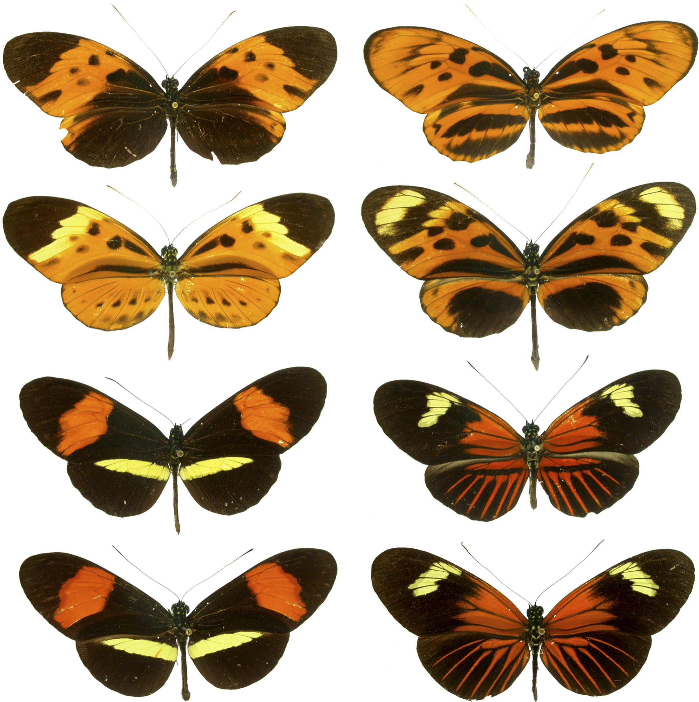

:::

::::

## [Common patterns of genetic structure]{style="font-family:Comic Sans MS;font-weight:normal;color:purple"} {background=''}

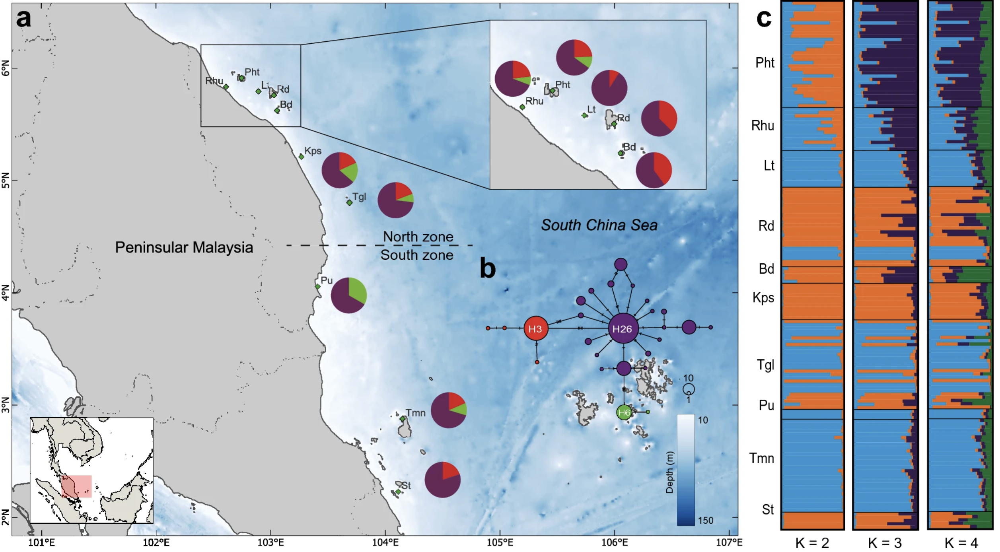{width=92%}

## [Common patterns of genetic structure]{style="font-family:Comic Sans MS;font-weight:normal;color:purple"} {background=''}

  
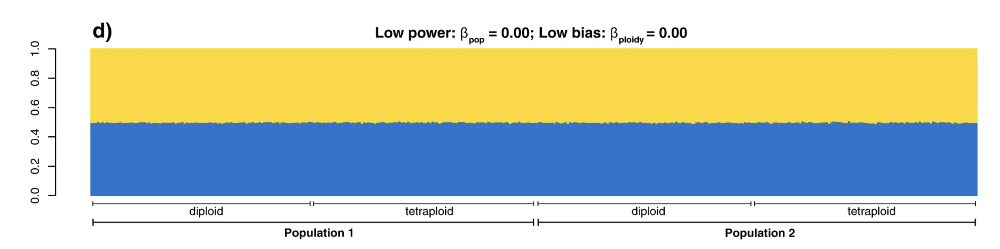{width=90%}

## [   Does the lack of genetic structure reflect absence of divergence selection?]{style="font-family:Comic Sans MS;font-weight:normal;color:purple"} {background=''}

## [Selection-migration balance]{style="font-family:Comic Sans MS;font-weight:normal;color:purple"} {background=''}

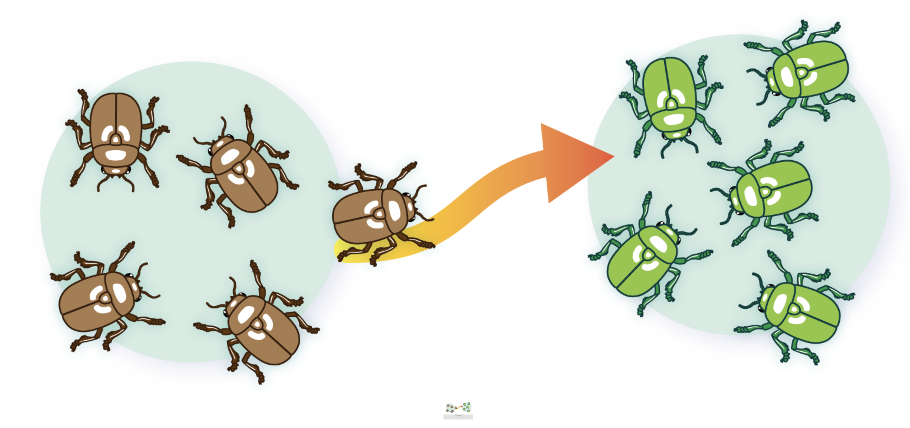{width=70%}

## [Colonization to new environments]{style="font-family:Comic Sans MS;font-weight:normal;color:purple"} {background=''}

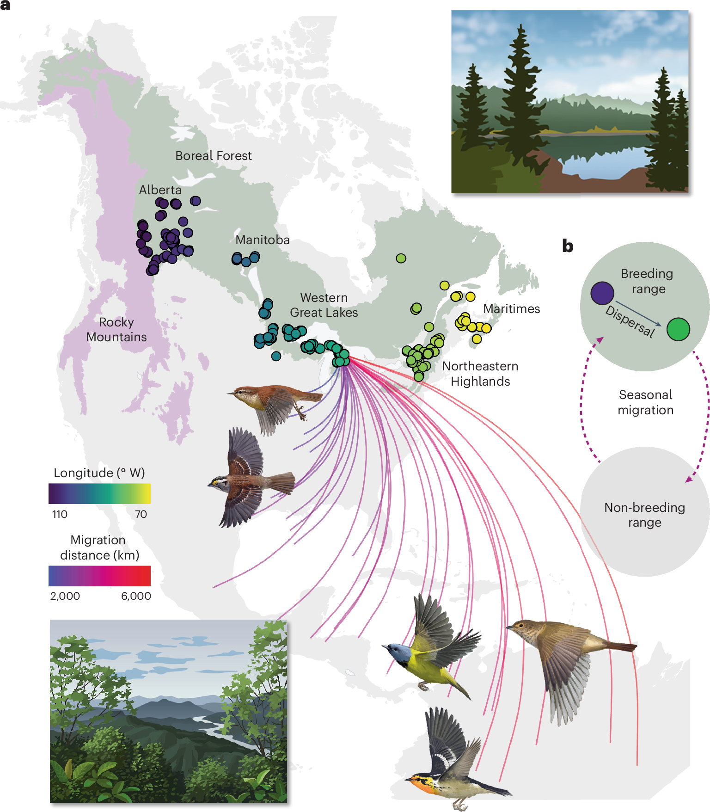{width=45%}

## [Compelling system to examine these hypotheses]{style="font-family:Comic Sans MS;font-weight:normal;color:purple"} {background=''}

:::: {.columns}

::: {.column width='50%'}

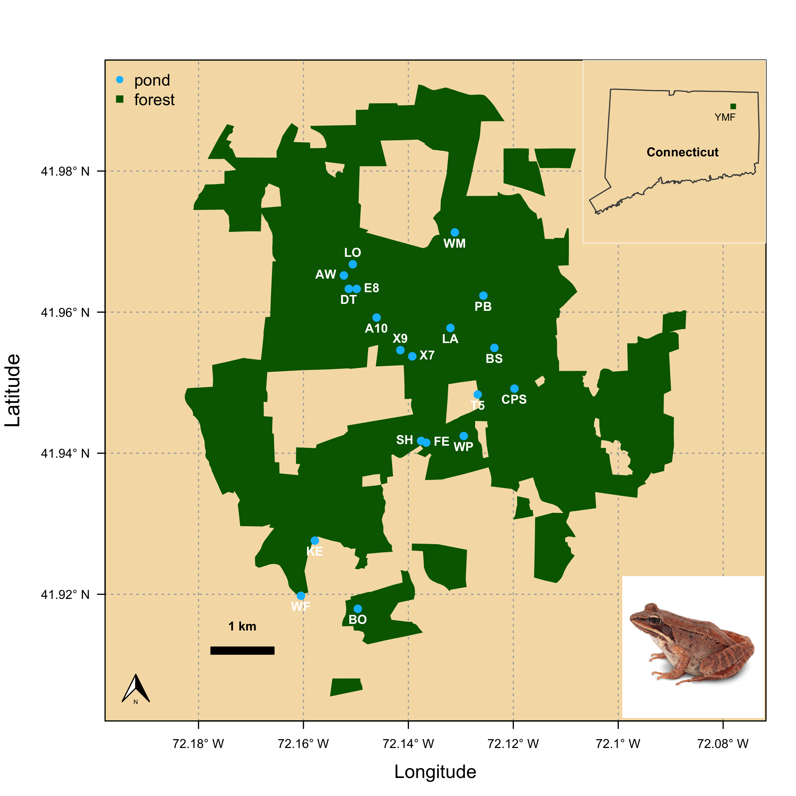

:::

::: {.column width='50%'}

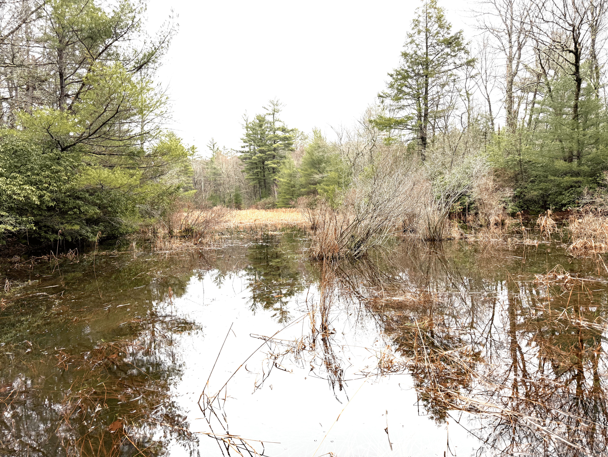{width=60%}
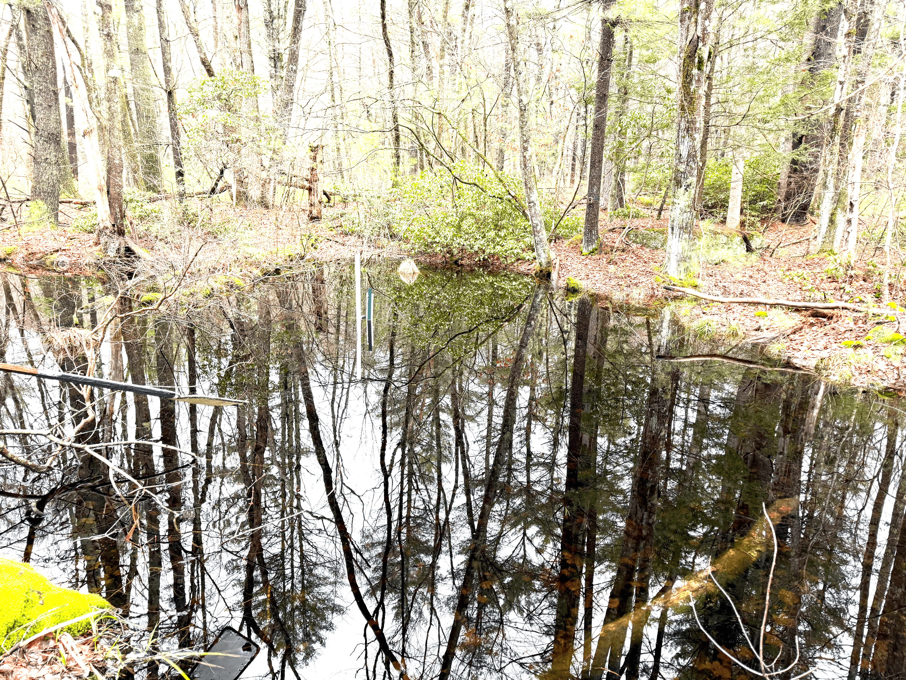{width=60%}

:::

::::

## [Compelling system to examine these hypotheses]{style="font-family:Comic Sans MS;font-weight:normal;color:purple"} {background=''}

:::: {.columns}

::: {.column width='50%'}

:::

::: {.column width='50%'}

  
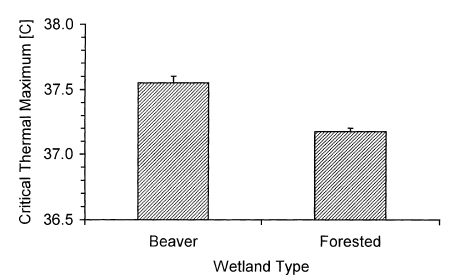 
Skelly, 2000. Ecology Letters.

:::

::::

## [Range of wood frog]{style="font-family:Comic Sans MS;font-weight:normal;color:purple"} {background=''}

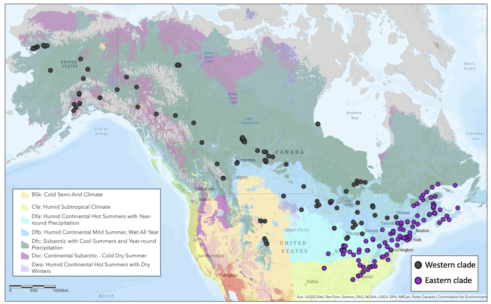{width=80%}

# [Methods]{style="font-family:Comic Sans MS;font-weight:normal;color:purple"} {background=''}

## [Genetic analysis]{style="font-family:Comic Sans MS;font-weight:normal;color:purple"} {background=''}

 

- In 2018, we assembled a comprehensive dataset of ddRAD samples collected from wood frog populations distributed across 19 wetlands at Yale-Myers forest

- We processed the raw reads using the ipyrad v.0.9.107 pipeline, using the wood frog reference genome and its annotation

- To understand how individuals were genetically related, we estimated admixture proportions and the fixation index (Fst) across our samples.

## [Demographic inference]{style="font-family:Comic Sans MS;font-weight:normal;color:purple"} {background=''}

 

We inferred the demographic history of the wood frog by employing a composite likelihood approach using *fastsimcoal2*

## [Demographic inference]{style="font-family:Comic Sans MS;font-weight:normal;color:purple"} {background=''}

 

We inferred the demographic history of the wood frog by employing a composite likelihood approach using *fastsimcoal2*

## [Selection signatures across the genome]{style="font-family:Comic Sans MS;font-weight:normal;color:purple"} {background=''}

 

- To detect signatures of local adaptation across the genome of the wood frog, we performed a genotype$\times$environment association analysis based on a latent factor mixed model

- We used the anottation file generated from the wood frog genome annotation described above to extract gene names associated with the candidate loci under selection

## [Selection on phenotypes]{style="font-family:Comic Sans MS;font-weight:normal;color:purple"} {background=''}

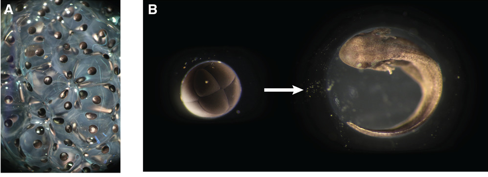

- We compared the divergence of a phenotypic trait such as embryonic development with the total genetic differentiation observed across populations of the wood frog (overall $F_{st}$)

## [Selection on phenotypes]{style="font-family:Comic Sans MS;font-weight:normal;color:purple"} {background=''}

- This experimental designed enabled us to partition the total genetic variance for embryonic development into two main components: the variance among populations and the variance within populations

## [Selection on phenotypes]{style="font-family:Comic Sans MS;font-weight:normal;color:purple"} {background=''}

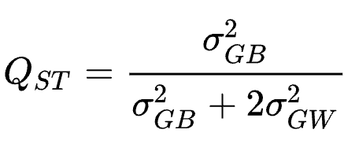

Where $\sigma^2_{GB}$ represents the genetic variance among populations and $\sigma^2_{GW}$ the additive genetic variance within populations

# [Results]{style="font-family:Comic Sans MS;font-weight:normal;color:purple"} {background=''}

## [Populations of the wood frog are genetically homogeneous]{style="font-family:Comic Sans MS;font-weight:normal;color:purple;font-size:45px"} {background=''}

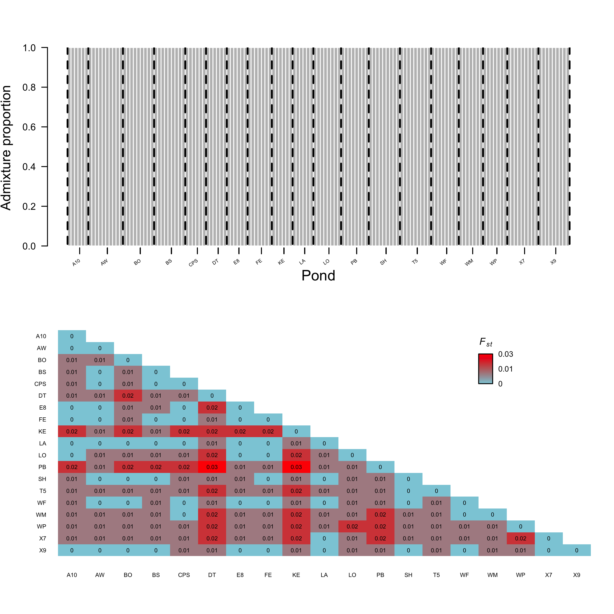{width=50%}

## [Recent divergence populations from a common ancestor approximately 24 generations ago]{style="font-family:Comic Sans MS;font-weight:normal;color:purple;font-size:45px"} {background=''}

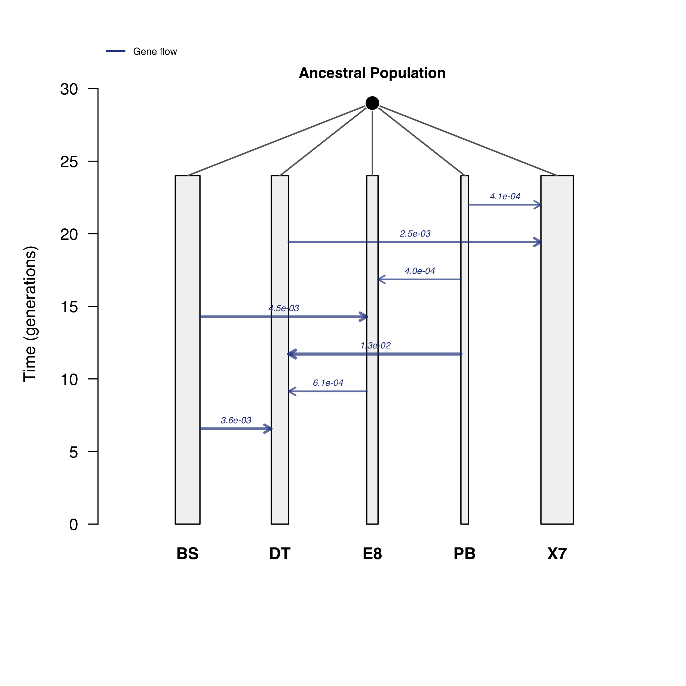{width=50%}

## [The genotype$\times$environment association analysis reveals two outlier loci:]{style="font-family:Comic Sans MS;font-weight:normal;color:purple"} {background=''}

:::: {.columns}

::: {.column width='50%'}

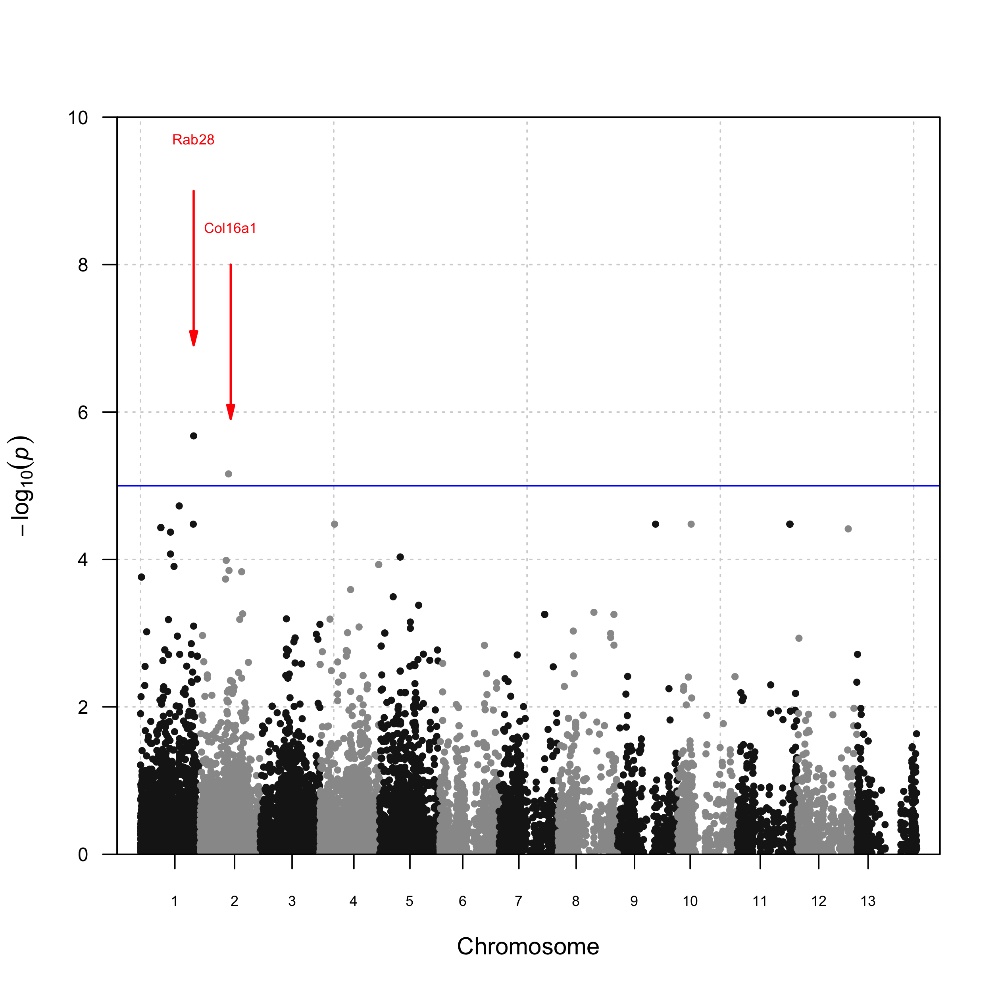

:::

::: {.column width='50%'}

:::

::::

## [The genotype$\times$environment association analysis reveals two outlier loci:]{style="font-family:Comic Sans MS;font-weight:normal;color:purple"} {background=''}

:::: {.columns}

::: {.column width='50%'}

:::

::: {.column width='50%'}

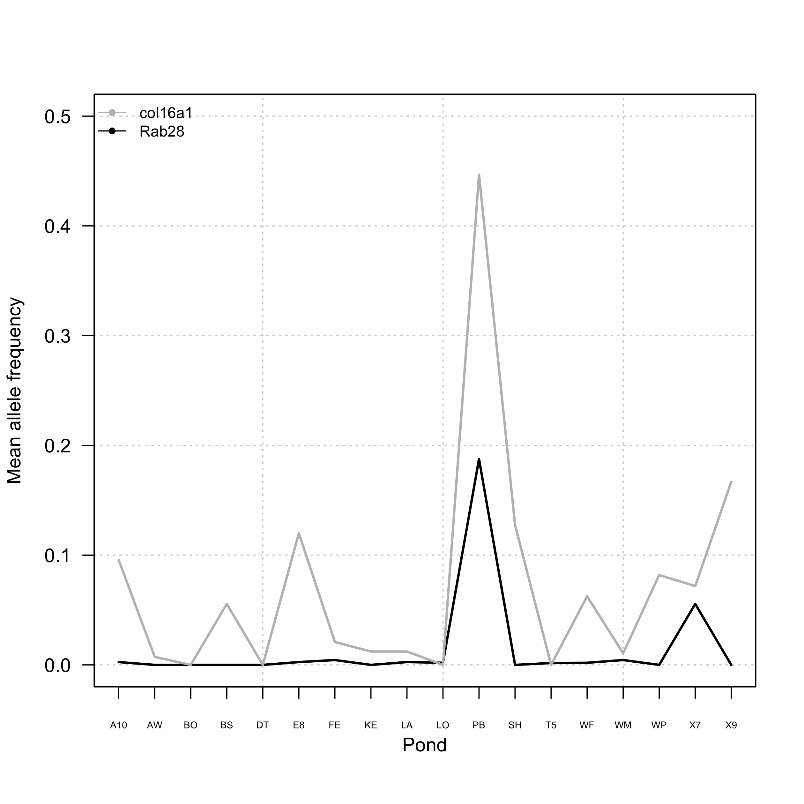

:::

::::

## [The genotype$\times$environment association analysis reveals two outlier loci:]{style="font-family:Comic Sans MS;font-weight:normal;color:purple"} {background=''}

:::: {.columns}

::: {.column width='50%'}

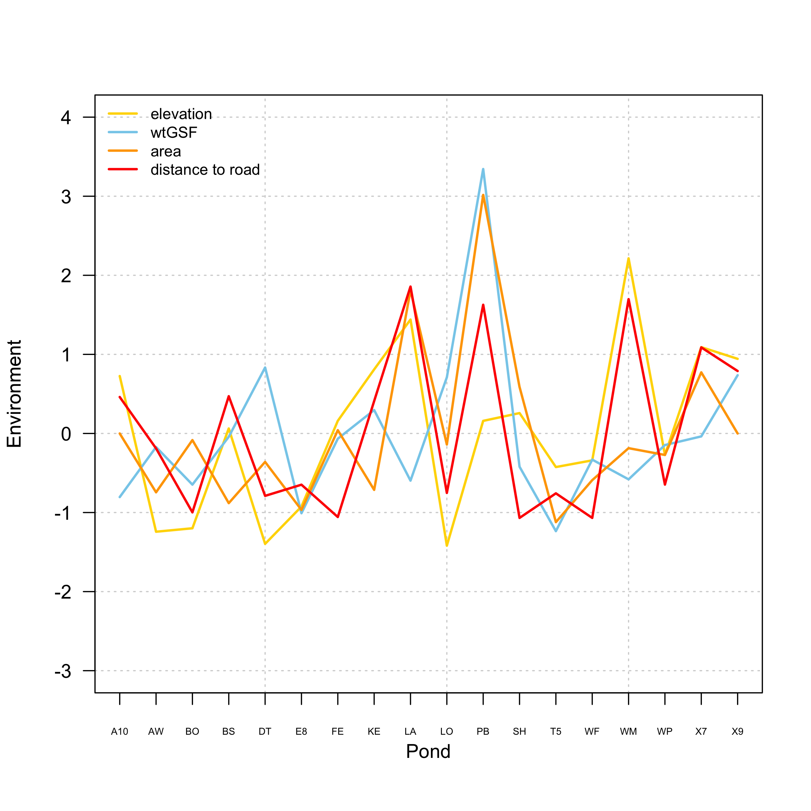

:::

::: {.column width='50%'}

:::

::::

## [Significant signature of divergent selection]{style="font-family:Comic Sans MS;font-weight:normal;color:purple"} {background=''}

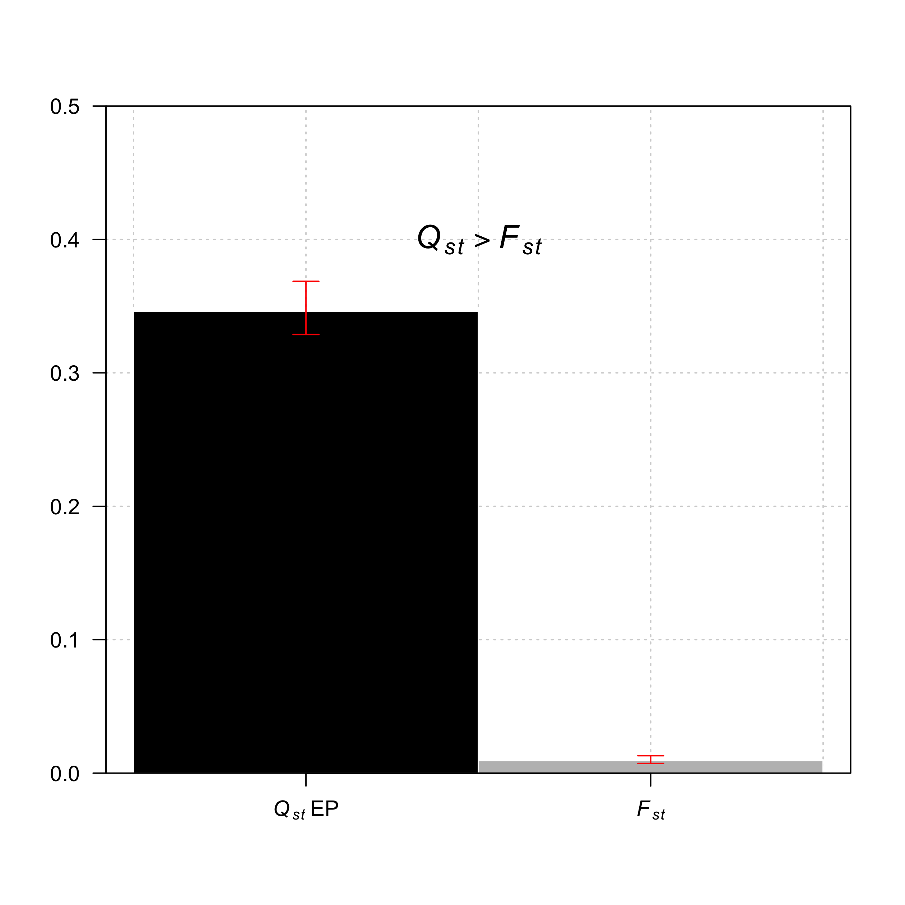{width=50%}

## [Concluding remarks]{style="font-family:Comic Sans MS;font-weight:normal;color:purple"} {background=''}

  

This genomic signature of selection together with a remarkable phenotypic differentiation strongly suggests that natural selection overcomes the power of genetic drift, even in a landscape characterized by a recent colonization and significant connectivity
